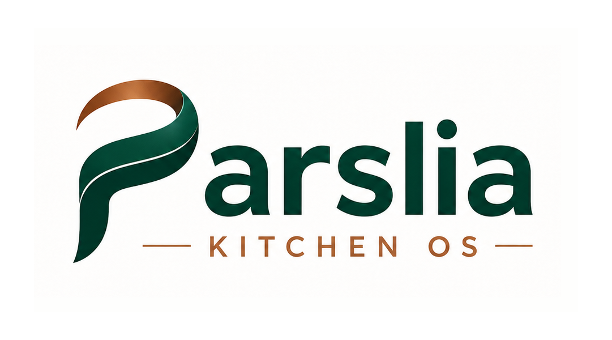
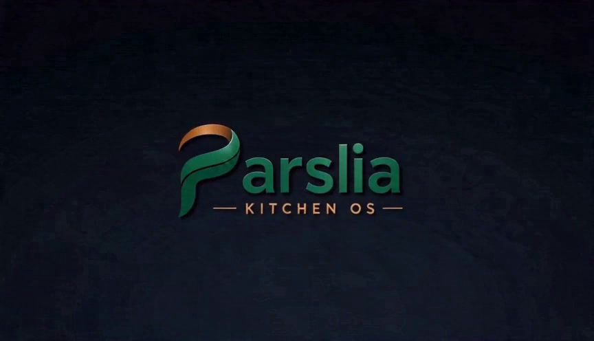

# parslia-kitchen-os
<!DOCTYPE html>
<html lang="en">
<head>
  <meta charset="UTF-8" />
  <meta name="viewport" content="width=device-width, initial-scale=1.0" />

  <title>Parslia Kitchen OS | Smart Kitchen Software for Chefs</title>
  <meta name="description" content="Parslia Kitchen OS helps chefs and food teams manage recipes, menus, allergens, stock, suppliers, rota, logs, labels and kitchen operations in one professional system." />
  <meta name="keywords" content="kitchen software, chef app, recipe management, menu planner, allergen software, catering software, kitchen OS, Parslia" />
  <meta name="theme-color" content="#063F32" />
  <link rel="canonical" href="https://parslia.app/" />

  <meta property="og:type" content="website" />
  <meta property="og:title" content="Parslia Kitchen OS | Smart Kitchen Software for Chefs" />
  <meta property="og:description" content="Smarter kitchens. Calmer chefs. Manage recipes, menus, allergens, stock, suppliers, rota and logs in one calm, organised system." />
  <meta property="og:url" content="https://parslia.app/" />
  <meta property="og:image" content="assets/USE_THIS_parslia_app_icon_1024.png" />
  <meta name="twitter:card" content="summary_large_image" />

  <!-- Favicon / app icon: use ONLY the provided app-icon file -->
  <link rel="icon" href="assets/USE_THIS_parslia_app_icon_1024.png" />
  <link rel="apple-touch-icon" href="assets/USE_THIS_parslia_app_icon_1024.png" />

  <link rel="preconnect" href="https://fonts.googleapis.com" />
  <link rel="preconnect" href="https://fonts.gstatic.com" crossorigin />
  <link href="https://fonts.googleapis.com/css2?family=Fraunces:opsz,wght@9..144,500;9..144,600;9..144,600&family=Inter:wght@400;500;600;700&display=swap" rel="stylesheet" />
  <link rel="stylesheet" href="styles.css" />

  
</head>
<body>
  <a class="skip-link" href="#main">Skip to content</a>

  <!-- 1. Header / navigation -->
  <header class="site-header" id="top">
    

      <a class="brand" href="#top" aria-label="Parslia Kitchen OS home">
        
        Parslia&nbsp;Kitchen OS
      </a>

      <nav class="nav" aria-label="Primary">
        <a href="#features">Features</a>
        <a href="#modules">Modules</a>
        <a href="#for-kitchens">For Kitchens</a>
        <a href="#early-access">Early Access</a>
        <a class="btn btn-primary btn-sm" href="#early-access">Request Early Access</a>
      </nav>

      <button class="nav-toggle" aria-label="Open menu" aria-expanded="false" aria-controls="mobileNav">
        
      </button>
    

    <nav class="mobile-nav" id="mobileNav" aria-label="Mobile">
      <a href="#features">Features</a>
      <a href="#modules">Modules</a>
      <a href="#for-kitchens">For Kitchens</a>
      <a href="#early-access">Early Access</a>
      <a class="btn btn-primary" href="#early-access">Request Early Access</a>
    </nav>
  </header>

  <main id="main">

    <!-- 2. Hero -->
    <section class="hero">
      

        

          
          Now preparing for selected kitchens
          <h1>Smarter kitchens. Calmer chefs.</h1>
          

            Parslia Kitchen OS helps professional kitchens manage recipes, menus, allergens,
            stock, suppliers, rota, logs, labels and daily food operations in one calm,
            organised system.
          

          

            <a class="btn btn-primary" href="#early-access">Request Early Access</a>
            <a class="btn btn-outline" href="#features">View Features</a>
          

          

            Built for chefs, caterers, retreat centres, hospitality teams and vegetarian food operations.
          

        

        <!-- App preview mockup (UI only, no logo redraw, no food photos) -->
        

          

            

              
              
parslia.app

            

            

              <aside class="app-side">
                

                  
                

                Dashboard
                Recipes
                Menu Planner
                Allergens
                Stock
                Rota
                Logs
              </aside>
              

                
Today's kitchen

                

                  
<b>18</b>Recipes on menu

                  
<b>4</b>Allergen flags

                  
<b>7</b>Staff on rota

                

                
Fridge &amp; freezer checks<em class="ok">Complete</em>

                
Supplier order — dry goods<em>Draft</em>

                
Lunch service prep<em class="ok">On track</em>

              

            

          

        

      

    </section>

    <!-- 3. Trust / audience strip -->
    <section class="strip" id="for-kitchens">
      

        Professional kitchens
        Catering teams
        Retreat centres
        Hotels &amp; hospitality
        Vegetarian restaurants
        Food production
      

    </section>

    <!-- 4. Problem -->
    <section class="section section-light">
      

        

          The daily reality
          <h2>Kitchen work is chaotic. Your system shouldn't be.</h2>
          

            Menus change, guests change, allergens matter, rotas move, stock runs low and
            suppliers need clear orders — usually spread across paper, spreadsheets and memory.
            Parslia replaces the scattered mess with one calm, organised place.
          

        

        

          
<h3>Paper everywhere</h3>
Recipes, checks and orders lost across folders, notebooks and printouts.

          
<h3>Allergen risk</h3>
Manual allergen tracking is slow and easy to get wrong under service pressure.

          
<h3>Disconnected tools</h3>
Stock, rota, menus and suppliers live in separate places that never talk to each other.

        

      

    </section>

    <!-- 5. Features -->
    <section class="section section-soft" id="features">
      

        

          Features
          <h2>One system for your whole kitchen.</h2>
          
Everything a busy food team needs to plan, prepare and stay compliant — connected in one place.

        

        

          <article class="card">
&#128218;
<h3>Recipe Library</h3>
Create, store, scale and print professional recipes.
</article>
          <article class="card">
&#128197;
<h3>Menu Planner</h3>
Plan breakfast, lunch, dinner, retreats, events and buffets.
</article>
          <article class="card">
&#9888;&#65039;
<h3>Allergen Control</h3>
Clear allergen information for every dish and menu.
</article>
          <article class="card">
&#128230;
<h3>Stock &amp; Suppliers</h3>
Track ingredients, suppliers, orders and purchasing.
</article>
          <article class="card">
&#128101;
<h3>Rota &amp; Staff</h3>
Manage shifts, roles, attendance and team hours.
</article>
          <article class="card">
&#9989;
<h3>Logs &amp; Checks</h3>
Fridge, freezer, cleaning, opening and closing checks.
</article>
          <article class="card">
&#128202;
<h3>Reports</h3>
See kitchen activity, compliance and costs at a glance.
</article>
          <article class="card">
&#127991;&#65039;
<h3>Labels</h3>
Print prep, date and allergen labels in seconds.
</article>
        

      

    </section>

    <!-- 6. How it works -->
    <section class="section section-light">
      

        

          How it works
          <h2>Up and running in four calm steps.</h2>
        

        

          
1<h3>Set up your kitchen</h3>
Add your team, suppliers and preferences once.

          
2<h3>Build recipes &amp; menus</h3>
Create recipes, scale portions and plan menus fast.

          
3<h3>Run daily operations</h3>
Manage stock, rota, allergens, labels and checks.

          
4<h3>Review &amp; improve</h3>
Use reports to stay compliant and control cost.

        

      

    </section>

    <!-- 7. Modules -->
    <section class="section section-dark" id="modules">
      

        

          Modules
          <h2>Everything, connected.</h2>
          
Parslia Kitchen OS brings every part of kitchen operations into one platform.

        

        <ul class="modules">
          <li>Dashboard</li>
          <li>Recipes</li>
          <li>Menu Planner</li>
          <li>Allergens</li>
          <li>Stock</li>
          <li>Suppliers</li>
          <li>Orders</li>
          <li>Rota</li>
          <li>Fridge &amp; Freezer Logs</li>
          <li>Cleaning Logs</li>
          <li>Labels</li>
          <li>Reports</li>
          <li>Settings</li>
        </ul>
      

    </section>

    <!-- 8. App preview -->
    <section class="section section-soft">
      

        

          App preview
          <h2>Calm, clear and made for service.</h2>
          

            A clean dashboard shows today's menus, checks, stock and rota at a glance — so your
            team always knows what matters right now. Available on desktop and tablet in the kitchen.
          

          <ul class="ticks">
            <li>Live daily overview</li>
            <li>Allergens visible on every dish</li>
            <li>One tap to labels, logs and reports</li>
          </ul>
        

        

          

            
          

          

            
Parslia

            
<b>Menu — Lunch</b>18 dishes · 4 allergen flags

            
<b>Rota</b>7 staff · 2 shifts

            
<b>Checks</b>Fridge &amp; cleaning complete

          

        

      

    </section>

    <!-- 9. Benefits -->
    <section class="section section-light">
      

        

          Why Parslia
          <h2>Less paper. Less stress. More control.</h2>
        

        

          
01<h3>Plan faster</h3>
Build menus and recipes quickly.

          
02<h3>Stay safer</h3>
Keep allergens and logs clear.

          
03<h3>Run smoother</h3>
Connect recipes, stock, rota and orders.

        

      

    </section>

    <!-- 10. Early access / contact -->
    <section class="section section-accent" id="early-access">
      

        

          <h2>Get early access</h2>
          

            Interested in Parslia Kitchen OS for your kitchen, retreat centre or catering
            operation? Send us your details and we will contact you.
          

          
<a href="mailto:hello@parslia.app">hello@parslia.app</a>

        

        <form class="contact-form" id="contactForm" novalidate>
          

            <label for="name">Name</label>
            <input type="text" id="name" name="name" autocomplete="name" required />
          

          

            <label for="email">Email</label>
            <input type="email" id="email" name="email" autocomplete="email" required />
          

          

            <label for="company">Company / kitchen name</label>
            <input type="text" id="company" name="company" autocomplete="organization" />
          

          

            <label for="role">Role</label>
            <input type="text" id="role" name="role" placeholder="e.g. Head Chef, Owner, Manager" />
          

          

            <label for="message">Message</label>
            <textarea id="message" name="message" rows="4"></textarea>
          

          <button type="submit" class="btn btn-primary">Request Early Access</button>
          

        </form>
      

    </section>
  </main>

  <!-- 11. Footer -->
  <footer class="site-footer">
    

      

        
        
Parslia Kitchen OS

        
Smarter kitchens. Calmer chefs.

      

      <nav class="footer-links" aria-label="Footer">
        <a href="#features">Features</a>
        <a href="#modules">Modules</a>
        <a href="#for-kitchens">For Kitchens</a>
        <a href="#early-access">Early Access</a>
      </nav>
    

    

      
&copy; 2026 Parslia. All rights reserved.

    

  </footer>

  
</body>
</html>
