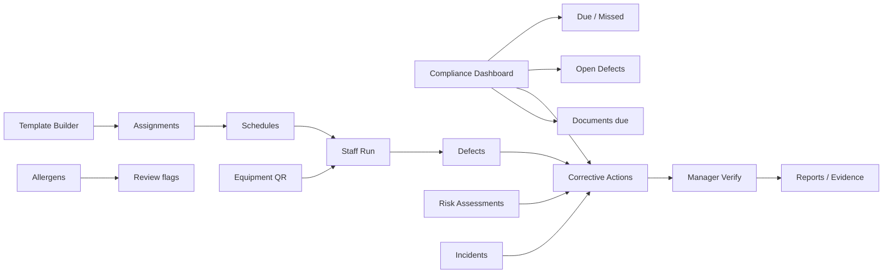

# Kiteline Complete Compliance System — Pre-Development Plan

**Status:** Phase 1 **approved and implemented** in `kiteline-saas` (see `PHASE_1_COMPLIANCE.md`). Do **not** start Phase 2/3 AI, SMS, sensors, or paid third-party integrations until costs are confirmed.  
**Brand rule:** Original Kiteline product. Do not copy Shield Safety (or any competitor) design, code, branding, wording, or proprietary templates. Use standard compliance *concepts* only.  
**UI rule:** Keep Kiteline branding and existing visual style. Kitchen-staff flows must stay simple and fast.

Central workflow every module must support:

```text
Schedule → Complete → Validate → Detect failure → Raise corrective action
→ Resolve → Manager verification → Report
```

---

## 1. What already exists in Kiteline

Inventory based on the live Kiteline app (`kitline1` / kiteline.uk) plus the SaaS package in this repo (`kiteline-saas/`).

| # | Module / capability | Status | What works today | Key locations |
|---|---------------------|--------|------------------|---------------|
| 1 | Monitoring & checklists | **Partial** | Opening/closing/CCP checklists, tick items, recurrence, assignees, overdue views | `js/views.js`, `js/store.js`, schema `haccp_checklists` / `haccp_completions` |
| 2 | Food safety & HACCP | **Partial** | Temp logs, deliveries, cooling/holding, batches; HACCP plan step templates (KHACCP); SafeServe marketing | `views.js`, `compliance.js`, `site/product-haccp.html` |
| 3 | Risk assessments | **Partial** | Kitchen risk records (likelihood/severity/residual), sample areas | `compliance.js` / `compliance-views.js` (JSON, not Postgres-first) |
| 4 | Audits & inspections | **Thin** | H&S walkthrough logs; print/CSV “audit” exports | compliance + reports views |
| 5 | Incidents & accidents | **Partial** | Ops incidents + separate accident-book records | `incidents` table + compliance `accidents` |
| 6 | Corrective actions | **Thin** | Action text on fails/incidents; **no** CAPA register | scattered fields |
| 7 | Equipment & maintenance | **Partial** | Assets, repair tickets, PPM-style records | `assets`, `maintenance_logs`, compliance PPM |
| 8 | Document registry | **Thin** | FSMS document *titles*/metadata seeded from templates | `fsmsDocuments` — no controlled file store |
| 9 | Policies & procedures | **Thin** | Template names only | FSMS seed list |
| 10 | Staff training | **Partial** | Certificate matrix + inductions; Academy is separate (not food LMS) | `training_records`, Academy site |
| 11 | Fire safety | **Thin** | Fire/PPE/first-aid check logs | `safetyChecks` |
| 12 | COSHH | **Partial** | Chemical register fields + samples | `coshh` in compliance.js (JSON) |
| 13 | Allergens | **Strong partial** | UK 14 allergens, MenuGuard, recipes, labels, guest QR menus | `allerq`, recipes, LabelSmart |
| 14 | To-dos & alerts | **Partial** | Workflow overdue, in-app alerts, channel toggles | alerts / workflows |
| 15 | Reports & evidence | **Partial** | CSV/JSON/print; ZIP for compliance dump — **not** inspector PDF pack | reports + `exportAuditZip` |
| 16 | Compliance dashboard | **Partial** | Hub + SafeServe-style overview; score mostly temp/breach driven | dashboard / hub / compliance overview |
| 17 | Org hierarchy | **Partial** | Sites today; SaaS designs **Company → Location**; missing Division/Region/Department/Area/Equipment tree | `kiteline-saas/schema/001_core_tenancy.sql` |
| 18 | Roles & permissions | **Partial** | UI Admin/Manager/Staff; SaaS roles Owner/Kitchen Admin/Location Manager/Staff + RLS design | `ROLES_AND_PERMISSIONS.md` |
| 19 | QR / barcodes | **Partial** | Staff install QR, menu QR, label QR — **not** equipment station QR workflow | views |
| 20 | Temperature monitoring | **Strong partial** | Manual + simulated sensors, charts, breaches; hardware pilot | temps, ingest API |
| 21 | Offline / mobile | **Thin** | PWA shell; not offline-first sync for checklist answers | `sw.js` |
| 22 | Audit trail | **Thin** | Activity ring + designed `audit_logs`; not immutable compliance ledger | store + schema |
| 23 | AI | **Optional / limited** | Rule “insights”; Recipe AI when configured; no compliance AI assist | recipe-ai, dashboard |
| 24 | Notifications | **Partial** | Email when SMTP configured; SMS/push not reliable product features | `notify.js` |

### Existing SaaS foundation (reusable)

- Postgres tenancy: companies, locations, memberships, RLS  
- Ops tables: temperatures, cleaning, maintenance, HACCP checklists/completions, deliveries, incidents, assets, training, clock, audit_logs  
- Runtime tenancy API patches under `kiteline-saas/runtime/`

### Explicit gaps vs this request

Missing or only sketched: drag-and-drop checklist builder, section/versioning, smart defect engine, full CAPA lifecycle with independent verification, Division→Area→Equipment hierarchy, template assignment scopes, inspector evidence pack, controlled document file registry, full RA builder with adoption, RIDDOR-ready incidents, allergen change cascade, equipment QR ops, offline sync queue, voice entry, multilingual staff instructions, configurable RAG thresholds, Platform Super Admin console for compliance templates.

---

## 2. Missing features (build list)

Grouped by the requested modules. **Must-build** = required for a credible Phase 1 product.

### Must-build (Phase 1)

1. Checklist **template builder** (sections → questions → answer types → defect rules)  
2. Template **versioning** + publish/archive (shared section edit → new version, usage list)  
3. **Scheduling** engine (frequencies, windows, missed, grace, escalation hooks)  
4. Staff **completion** UI (kitchen-friendly, draft autosave, pause/resume)  
5. **Validate** answers (mandatory, min/max, expected, N/A rules)  
6. **Defect** auto-raise + **Corrective Action** register (separate permanent records)  
7. Manager **verification** (recorded-by ≠ verified-by for critical items)  
8. Temperature check packs with fail follow-up questions  
9. Compliance **dashboard** (due / missed / open defects / overdue CA)  
10. PDF + CSV exports for completions and defects  
11. Permission matrix for compliance actions  
12. Immutable-style **audit trail** (no silent edit/delete of completed records)

### Phase 2 (management)

Risk assessment builder + adoption; document registry with files/expiry; training plans; incident case types; allergen change cascade; equipment/maintenance depth; Kiteline-generated equipment QR; multi-location reporting; original Kiteline food-safety & cleaning template library (editable).

### Phase 3 (advanced)

Offline sync; AI assistance (labelled suggestions only); voice entry; multilingual instructions; live sensor commercial integration; advanced analytics; Inspector Evidence Pack (PDF/ZIP); external APIs; optional SMS (paid).

---

## 3. Existing features that need modification

| Existing feature | Change required |
|------------------|-----------------|
| `haccp_checklists` jsonb items | Expand to template/section/question/version model; keep migration path |
| Checklist completion | Draft status, pause/resume, late reason, verification fields, defect links |
| Incidents `action` string | Split into linked Corrective Action entities |
| Compliance JSON modules (RA, COSHH, FSMS, fire) | Move to Postgres + connect to CA/dashboard/alerts |
| Site switcher | Extend hierarchy: Division/Region → Location → Department → Area → Equipment |
| Roles (4 SaaS roles) | Add Regional Manager, Head Chef, Supervisor, Auditor, Read-only Inspector, Contractor; permission flags for template/CA/verify/export |
| Alerts | Wire to schedule miss, defect, CA overdue, certificate expiry |
| Allergen/recipe tools | On ingredient/recipe change → flag menus/labels/matrices for review |
| Reports | Structured exports matching inspector pack columns; PDF generation |
| PWA / SW | Offline answer queue + sync status (Phase 3) |
| Dashboard score | Weighted compliance score with company-configurable thresholds |
| Public marketing claims | Stay aligned with **Available now / Beta / Pilot / Planned** — do not claim compliance guarantees |

---

## 4. Database and security plan

### 4.1 Hierarchy

```text
companies
  └─ divisions (region)
       └─ locations
            └─ departments
                 └─ areas
                      └─ equipment_assets
```

Every operational row carries `company_id` and the narrowest relevant scope IDs. RLS enforces company isolation; location memberships restrict staff/manager reads.

### 4.2 Core compliance tables (new / evolved)

| Table group | Purpose |
|-------------|---------|
| `compliance_templates`, `template_sections`, `template_questions`, `template_versions` | Builder + versioning |
| `template_assignments` | Scope: company / division / location / dept / area / equipment / role / user |
| `location_template_overrides` | Local limits/instructions without mutating master |
| `checklist_schedules`, `checklist_runs`, `checklist_answers` | Scheduling + completion |
| `defects`, `corrective_actions`, `ca_verifications` | CAPA lifecycle |
| `risk_assessments`, `ra_hazards`, `ra_controls`, `ra_adoptions` | Phase 2 |
| `documents`, `document_versions` | Controlled registry |
| `training_courses`, `training_assignments`, `training_completions` | Phase 2 |
| `incident_cases`, `incident_timeline` | Phase 2 cases |
| `equipment_qr_codes` | Kiteline-generated QR payloads |
| `compliance_audit_events` | Append-only event log |
| `notification_rules`, `notification_outbox` | Escalations |

**Rule:** Completed runs and closed CAs are never hard-deleted. Corrections create a new event with reason; archive instead of delete.

### 4.3 Security

1. Server-side permission checks for every write (never trust client role).  
2. Postgres RLS on all compliance tables (`company_id`).  
3. Sensitive incident types: extra ACL (named roles only).  
4. Evidence (photos/docs) in private object storage; signed URLs; virus scan later if needed.  
5. Passwords hashed; HTTPS; secure cookies — only claim once verified in production.  
6. Independent verification: block same `user_id` as completer and critical verifier.  
7. Export/audit actions logged.  
8. Retention settings per company (default policy documented before commercial launch).  
9. Legal operator identity must be confirmed before paid B2B onboarding / signed DPA.

### 4.4 Stack recommendation

- Keep Kiteline SPA style for Phase 1 staff UI (large controls, fast).  
- Persist compliance in **Postgres** (Neon or confirmed host) — stop relying on JSON for compliance records.  
- PDF: server-side generation (e.g. HTML→PDF) for exports; confirm library licence/cost before lock-in.  
- QR: generate server-side (payload = signed equipment/area id); print CSS page — no external QR SaaS required.

---

## 5. Screen-by-screen wireframes

Keep existing Kiteline chrome (sidebar, brand colours). New area: **Compliance** with connected sub-nav (not isolated microsites).

### 5.1 Information architecture



### 5.2 Screens (Phase 1)

| Screen | Audience | Purpose | Primary actions |
|--------|----------|---------|-----------------|
| **C1 Dashboard** | Manager / Admin | Due today, missed, critical defects, overdue CA, RAG | Filter company/location/dept; open run; assign CA |
| **C2 My checks** | Staff | List due now / in progress drafts | Start, resume, scan QR |
| **C3 Run checklist** | Staff | Sectioned questions, large taps, camera, signature | Save draft, submit, raise defect |
| **C4 Defect detail** | Staff / Manager | Auto-created defect from fail | Add evidence, immediate action, link CA |
| **C5 CA board** | Manager | Open / in progress / awaiting verify / overdue | Assign, escalate, verify, close |
| **C6 CA verify** | Manager ≠ completer | Critical verification | Approve/reject with comment + evidence |
| **C7 Template library** | Admin | Draft / active / archived templates | New, duplicate, preview, publish, version |
| **C8 Builder** | Admin | Drag sections/questions | Add types, defect rules, preview staff view |
| **C9 Assign & schedule** | Admin | Scope + frequency + windows | Assign multi-location; pause location |
| **C10 Temperature packs** | Staff | Dedicated temp flows + fail follow-ups | Multi-reading cooling |
| **C11 Reports** | Manager / Auditor | Completions, missed, defects, CA | CSV / PDF export |
| **C12 Audit log** | Admin / Auditor | Immutable events | Filter, export |
| **C13 Permissions** | Owner / Admin | Role matrix for compliance | Toggle permissions |

### 5.3 Screens (Phase 2+)

| Screen | Module |
|--------|--------|
| R1–R4 | Risk assessment builder, hazard matrix, approval, location adoption |
| D1–D2 | Document registry list + expiry calendar |
| T1–T2 | Training plans + overdue |
| I1–I3 | Incident case, timeline, restricted view |
| E1–E3 | Equipment register, QR print, scan landing |
| A1 | Allergen change review queue |
| X1 | Inspector Evidence Pack wizard (date range → PDF/ZIP) |

### 5.4 Staff run (wire sketch)

```text
┌─────────────────────────────────────────┐
│ Kiteline · Location: Kitchen A          │
│ Opening checks · Due 10:00 · Draft auto │
├─────────────────────────────────────────┤
│ Section: Cold storage                   │
│                                         │
│ Fridge 1 temperature (°C) *             │
│ [  8.2  ]  Safe 0–5                     │
│ ⚠ Out of range — high risk defect       │
│ Photo [Take]  Comment [........]        │
│ Immediate action [........]             │
│                                         │
│ [Save draft]              [Next →]      │
└─────────────────────────────────────────┘
```

### 5.5 Builder (wire sketch)

```text
┌──────────────┬──────────────────────────┐
│ Sections     │ Question editor          │
│ • Cold store │ Type: Temperature        │
│ • Hot hold   │ Min 0  Max 5  Unit °C    │
│ + Add        │ Defect if out of range   │
│              │ Risk: High               │
│ Preview staff│ Evidence: Photo required │
│ Publish v3   │ CA template: Move food…  │
└──────────────┴──────────────────────────┘
```

---

## 6. Effort and indicative cost (by phase)

Calendar dates are **not** fixed here (they depend on who implements, review cycles, and legal/operator readiness). Complexity is given instead.

Indicative UK commercial ranges assume a small senior product engineering team building on the existing Kiteline SPA + Postgres SaaS foundation. **These are planning bands only — not a fixed quote.** Confirm rates, VAT status, and contract before committing.

| Phase | Scope summary | Complexity | Invasiveness | Indicative cost band (GBP, ex-VAT) |
|-------|---------------|------------|--------------|-------------------------------------|
| **Phase 1 — Essential** | Builder, schedule, run, temps, defects/CA, verify, dashboard, PDF/CSV, permissions, audit trail, org scope basics | **XL** | High — new data model + UI + migration from simple checklists | **£25,000 – £55,000** |
| **Phase 2 — Management** | RA builder, documents, training, incidents, allergens cascade, equipment QR, multi-location reporting, Kiteline template library | **XL** | High — many modules + file storage | **£20,000 – £45,000** |
| **Phase 3 — Advanced** | Offline sync, AI assist, voice, i18n, sensors commercial, analytics, evidence pack hardening, APIs, optional SMS | **XL+** | High — mobile sync + third parties | **£25,000 – £60,000+** (plus ongoing AI/SMS/sensor costs) |

**Ongoing costs to confirm before build (not included in build bands):**

| Service | When | Notes |
|---------|------|-------|
| Hosted Postgres | Phase 1 | Region must be confirmed before UK/EU residency claims |
| Object storage (evidence) | Phase 1 | Photos/docs |
| Transactional email | Phase 1 notifications | Required before password-reset/alert claims are “live” |
| PDF rendering | Phase 1 | Library or service licence |
| SMS (Twilio etc.) | Phase 3 optional paid | Per-message cost — **confirm before enabling** |
| AI provider | Phase 3 | Per-token — pilot only; never auto-close records |
| Sensor hardware / LoRaWAN | Phase 3 / pilot | Hardware + gateway + support |

---

## 7. Sequencing (not calendar dates)

Recommended order of delivery **inside** Phase 1:

1. Data model + RLS + audit events  
2. Permissions matrix  
3. Template builder + versioning  
4. Assignment + scheduling  
5. Staff run + autosave drafts  
6. Defect + CA + verification  
7. Temperature packs  
8. Dashboard  
9. Exports  
10. Seed original Kiteline opening/closing/temp templates (editable)  
11. Hardening + migration from legacy checklists  

Phase 2 starts only after Phase 1 checklist→CA→report loop is stable in production with real kitchens.  
Phase 3 starts only after offline/AI/SMS/sensor **unit economics** are approved.

---

## 8. Included in the present agreement (recommended packaging)

Until a signed SoW says otherwise, treat **this planning document** as the scope definition exercise. Recommended commercial packaging:

### Included now (agreement to plan + Phase 1 build when authorised)

- This gap analysis, DB/security plan, wireframes, phase split, test/deploy plan  
- **Phase 1 Essential** build when you explicitly approve start of development  
- Original Kiteline UI/content (no competitor cloning)  
- Keep existing Kiteline visual style  
- Migration path from current checklists/temps where practical  

### Not included until separately approved / paid

- Phase 2 Management modules  
- Phase 3 Advanced (offline app, AI, voice, i18n, commercial sensors, evidence-pack polish, external APIs)  
- Optional SMS as a paid add-on  
- Hardware procurement / sensor kits  
- Recipe AI general release pricing/allowances  
- Formal DPA signing (blocked until legal operator confirmed)  
- Professional legal review of Terms/liability  
- On-site kitchen consultancy or guaranteed regulatory compliance  

**Kiteline must never claim the software guarantees legal compliance.** It helps teams organise records for inspections.

---

## 9. Features requiring additional payment / confirmation

| Item | Why separate |
|------|----------------|
| Phase 2 & 3 engineering | Large incremental product surface |
| SMS notifications | Per-message third-party cost |
| AI assistance | Provider cost + governance |
| Commercial sensor programme | Hardware, logistics, support |
| Custom enterprise template writing | Content services |
| White-label / multi-brand | Product + legal |
| Formal penetration test / ISO consultancy | External specialists |
| Inspector Evidence Pack “certified” packaging | Extra QA + PDF engineering |

---

## 10. Testing and deployment plan

### 10.1 Testing

| Layer | Focus |
|-------|--------|
| Unit | Defect rules, schedule windows, permission checks, verification separation |
| Integration | API + RLS isolation across two companies/locations |
| UI | Staff run on phone viewport; builder publish/version |
| Data | Migration from legacy checklist completions; no silent mutation of closed records |
| Security | Cross-tenant access attempts; contractor/read-only scopes |
| Export | CSV column completeness; PDF generation smoke tests |
| Notification | Email outbox in staging; do not mark SMS/push live until tested |
| UAT | 1–2 pilot kitchens: opening/closing + fridge fail → CA → verify → export |

### 10.2 Deployment

1. Develop behind feature flag `compliance_v2` on staging.  
2. Apply schema migrations on staging Postgres; seed Kiteline templates.  
3. Dual-write or migrate read path from JSON checklists → Postgres.  
4. Pilot with selected locations only.  
5. Production cutover after UAT sign-off.  
6. Keep archive of pre-cutover exports.  
7. Do **not** enable AI/SMS/sensors in production without cost approval.  
8. Align public website status labels with what is actually live.

### 10.3 Definition of Done (Phase 1)

- Staff can complete a scheduled checklist offline-draft in browser session (autosave); full offline sync can wait for Phase 3.  
- Out-of-range temperature creates defect + CA.  
- Critical CA cannot be verified by the same user who completed it.  
- Manager dashboard shows due/missed/open/overdue.  
- CSV + PDF export of a completed run with defect/CA fields.  
- Audit events for create/submit/correct/verify/export.  
- No competitor-cloned UI/copy/templates.

---

## 11. Original Kiteline template library (content approach)

Write **new** Kiteline wording for Phase 1 seed set (editable):

- Kitchen opening / closing  
- Fridge & freezer temperature  
- Delivery acceptance  
- Cooking / reheating / hot holding  
- Cooling (multi-reading)  
- Probe calibration  
- Personal hygiene  

Phase 2 expands cleaning, pest, glass/brittle, illness declaration, etc.  
Each template: Kiteline instructions, configurable limits, defect rules, role assignment — **not** copied from third-party proprietary packs.

---

## 12. Decision checklist before coding starts

Please confirm:

1. **Approve Phase 1 scope** as defined in sections 6–8.  
2. **Legal operator** name/address for B2B contracts/DPA (placeholders remain until then).  
3. **Postgres + file storage** providers and regions.  
4. **Budget band** for Phase 1 (and whether Phase 2 is optioned).  
5. **Pilot kitchens** for UAT.  
6. Explicit **no** to starting AI/SMS/sensor commercial work until costs approved.  
7. Confirmation that competitor products are reference for *concepts only*, not design/copy.

---

## 13. Immediate next step after approval

When you reply **“Approve Phase 1 — start build”** (or equivalent):

1. Create schema migration `005_compliance_core.sql`  
2. Implement permissions + audit events  
3. Ship Template Builder → Schedule → Run → Defect/CA → Dashboard → Export  
4. Keep design system consistent; kitchen-first UX  
5. Update public feature-status labels only when features are tested  

Until that approval, this document is the deliverable for section 25 of your request.
